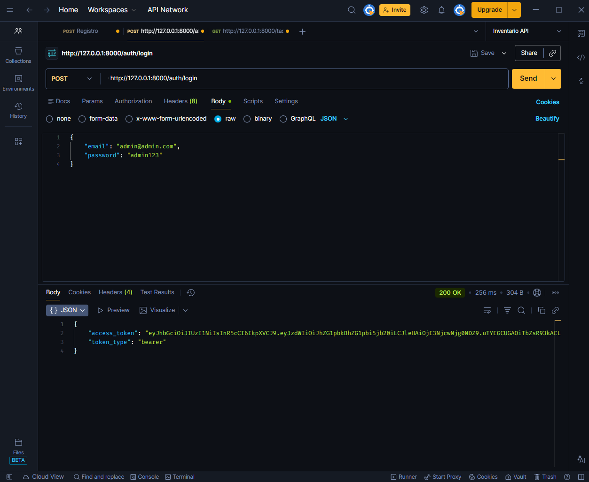
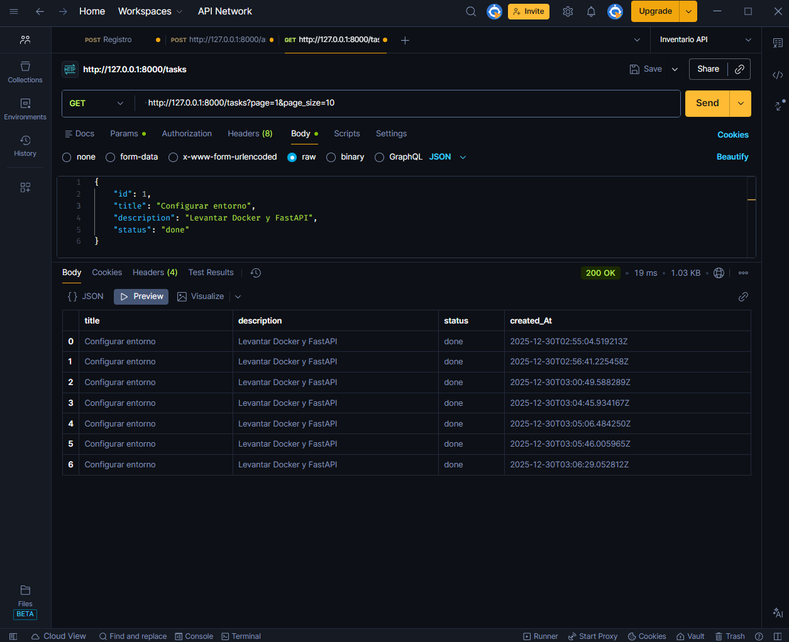
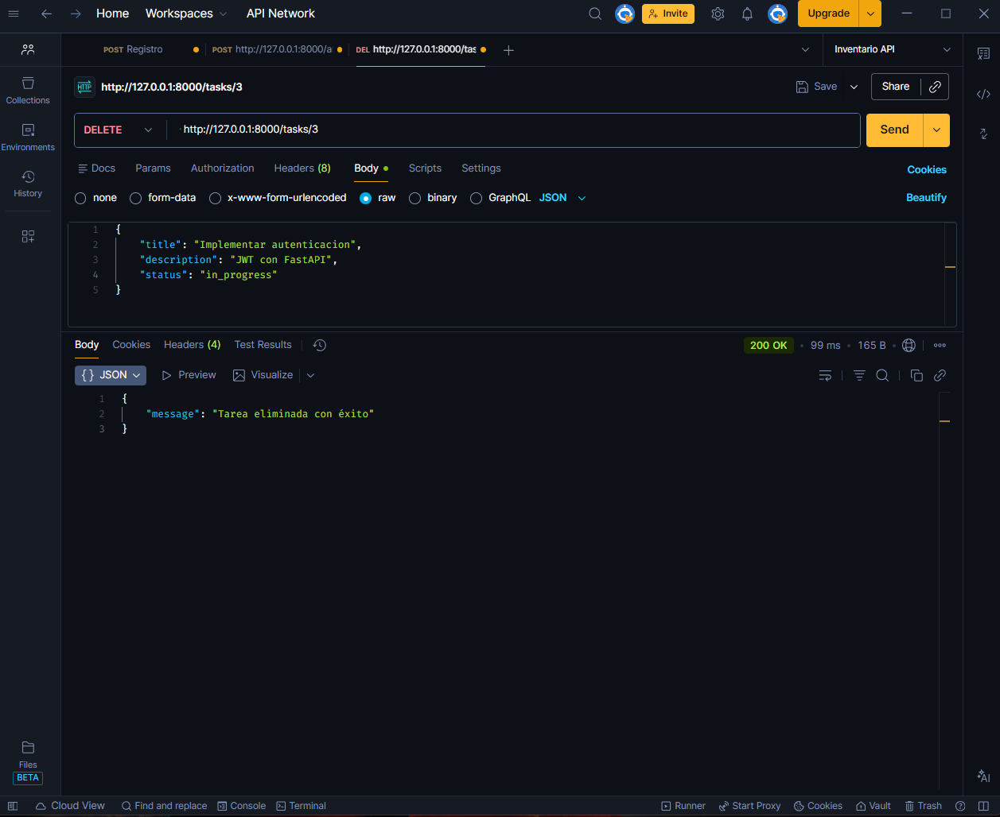
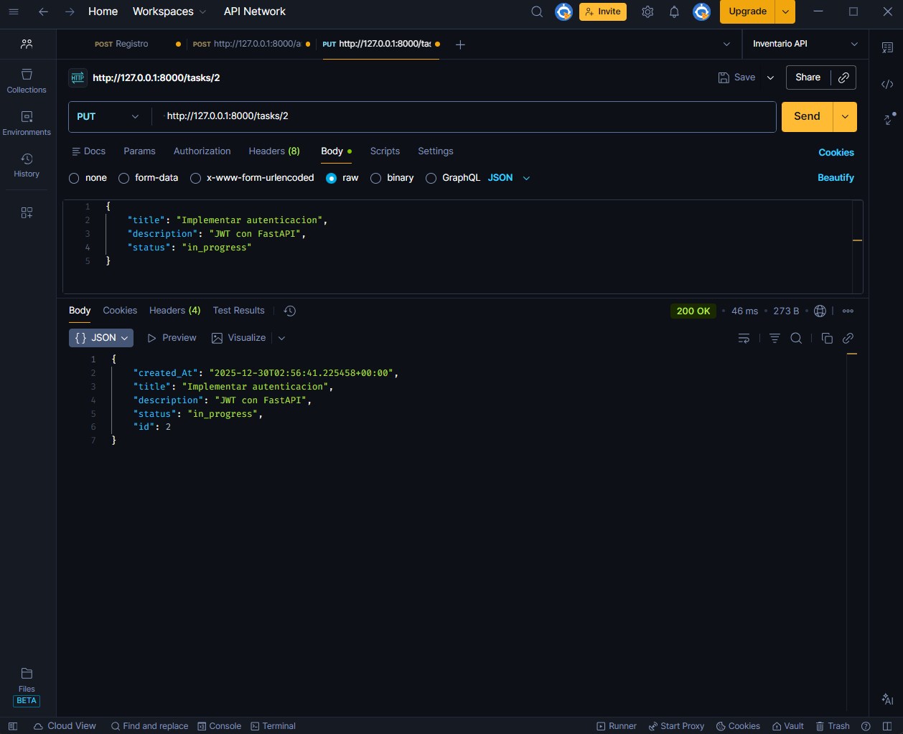

# Prueba Técnica Backend - Python (FastAPI)

## Descripción

El proyecto es una API REST construida con FastAPI, que permite la gestión de tareas con CRUD completo, autenticación JWT y persistencia en PostgreSQL. El proyecto está diseñado para ser seguro, mantenible y ejecutable end-to-end en un entorno local siguiendo las instrucciones de este README.

## Tecnologías

- Python 3.11
- FastAPI
- SQLAlchemy
- PostgreSQL (Docker)
- Alembic(migraciones)
- JWT (Autenticación)
- Bcrypt (hash de contraseñas)

## Instalación y ejecución

1. Clonar el repositorio

```bash
git clone <URL_REPOSITORIO>
cd <NOMBRE_REPOSITORIO>
```

2. Crear entorno virtual:

```bash
python -m venv venv
source venv/bin/activate # Linux / macOS
venv\Scripts\activate # Windows
```

3. Instalar dependencias:

``` bash
pip install -r requirements.txt
```

4. Configurar variables de entorno:

``` bash
DB_HOST=localhost
DB_PORT=5432
DB_NAME=technical_test
DB_USER=postgres
DB_PASSWORD=postgres
SECRET_KEY=<tu_secreto_para_jwt>
ACCESS_TOKEN_EXPIRE_MINUTES=60
``` 

5. Levantar PostgreSQL con Docker:

```bash
docker-compose up
```

6. Ejecutar migraciones

```bash
alembic upgrade head
```

7. Levantar la aplicación:

``` bash
uvicorn app.main:app --reload
```

## Entidades

### User

- id (primary key, index = true)
- username (nullable = true, index = true) // perimite hacer busquedas por nombre de usuario
- email (unique = true, index = true)
- password (nullable = false)
- is_active (default = True, index = true) // facilita búsqueda de usuarios activos

### Task

- id (primary key, index = true)
- title (nullable = false, index = true) //  buscar tareas por titulo
- description (nullable = true)
- status (default = pending, index = true) // posibilidad de filtros y/o búsqueda por estado
- created_at 


## Endpoints principales

### Auth

- `POST/auth/login` 
Autenticación JWT.
Payload ejemplo:

```json
{
    "email": "admin@admin.com",
    "password": "admin123"
}
```

- Usuario inicial creado automáticamente por medio de seed:
    - Email: `admin@admin.com`
    - Password: `admin123`

### Tasks

- `GET/tasks`-> Listado de tareas con paginación (page, page_size)
- `POST/tasks`-> Crear nueva tarea
- `GET/tasks/{id}`-> Obtener tarea por Id
- `PUT/tasks/{id}`-> Actualizar tarea por Id
- `DELETE/tasks/{id}`-> Eliminar tarea por Id


## Arquitectura del proyecto

El proyecto está organizado siguiendo una arquitectura modular, separando responsabilidades para facilitar el mantenimiento y la escalabilidad:

app/        
├── api/        # Routers y definición de endpoints          
├── core/       # Configuración, seguridad y JWT        
├── db/         # Sesión de base de datos y configuración       
├── models/     # Modelos SQLAlchemy        
├── schemas/    # Esquemas Pydantic     
├── services/   # Lógica de negocio     
├── main.py     # Punto de entrada de la aplicación     

Esta separación permite mantener los endpoints livianos y concentrar la lógica en capas reutilizables.

## Seguridad

- Autenticación basada en JWT.
- Contraseñas almacenadas usando hash seguro con bcrypt.
- Expiración del token configurable mediante variable de entorno.
- Endpoints de tareas protegidos, accesibles solo con token válido.

## Migraciones y datos iniciales

Se utilizan migraciones con Alembic para:

- Crear las tablas necesarias (`users`, `tasks`).
- Crear automáticamente un usuario inicial mediante seed.
- Garantizar que el proyecto pueda ejecutarse en un entorno limpio sin pasos manuales.

## Decisiones técnicas y trade-offs

- Se utilizó JWT con un único access token para mantener la autenticación simple y clara, evitando la complejidad adicional de refresh tokens para el alcance de la prueba.

- El usuario inicial se crea mediante una migración/seed en lugar de un endpoint administrativo, garantizando que el sistema sea usable desde el primer arranque sin configuraciones manuales.

- Se implementó paginación usando offset/limit (`page`, `page_size`) por su simplicidad y claridad, en lugar de paginación por cursor, que resulta más compleja y no necesaria para este contexto.


- Se definieron índices solo en campos relevantes para búsquedas frecuentes, evitando sobre-indexación innecesaria.

## Ejemplos de Uso

### Autenticación


### Crear tarea


### Listado de tareas


### Eliminar tarea


### Actualizar tarea


### Buscar tarea por id
